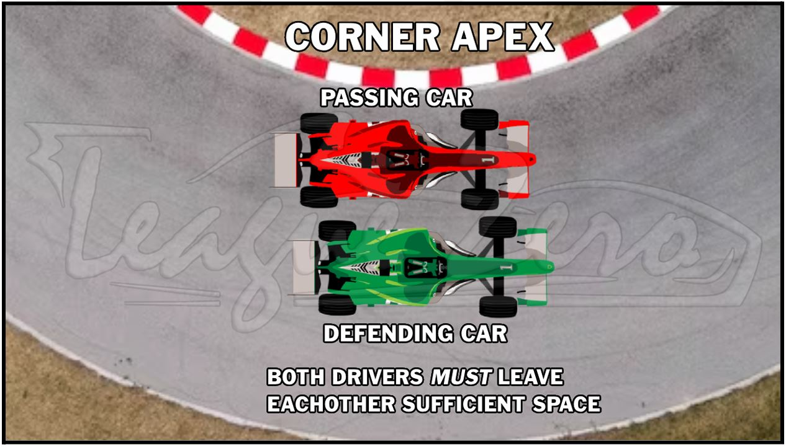
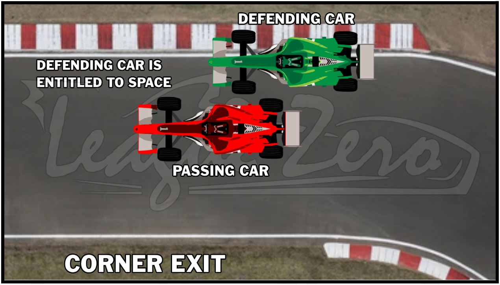
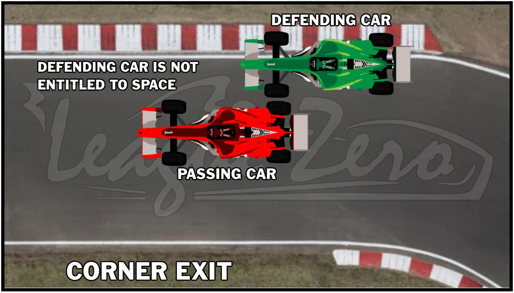
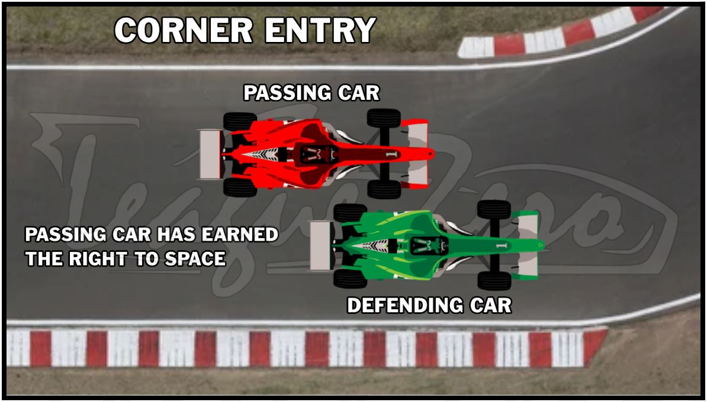
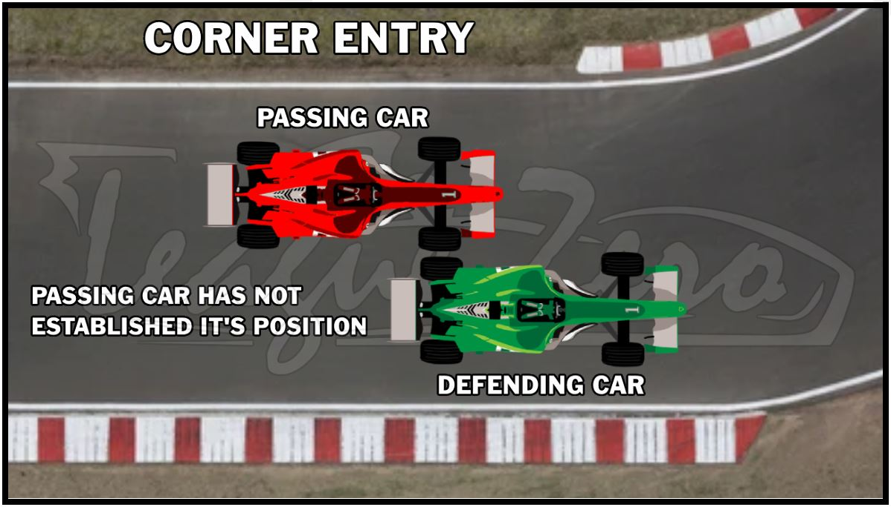

# Sporting Regulations  
**2024 - Season XII**  

**Document Version:** 046-12.02.2024

*Rules that have been added or modified in this version will be highlighted in <mark>yellow</mark>.*

## TABLE OF CONTENTS

- [ARTICLE 0 - DEFINITIONS](#article-0---definitions)
  - [0.1 Definitions Used in this Rulebook](#01---definitions-used-in-this-rulebook)

- [ARTICLE 1 - GENERAL INFORMATION](#article-1---general-information)
  - [1.1 Intent and Goal of League Zero](#11---intent-and-goal-of-league-zero)
  - [1.2 Software Exploitations Policy](#12---software-exploitations-policy)
  - [1.3 Code of Conduct & Privacy Policy](#13---code-of-conduct--privacy-policy)

- [ARTICLE 2 - REGISTRATION & ATTENDANCE](#article-2---registration--attendance)
  - [2.1 Registration](#21---registration)

- [ARTICLE 3 - SERIES INFORMATION](#article-3---series-information)
  - [3.1 Teams](#31---teams)
  - [3.1 Reserve Drivers](#32---reserve-drivers)

- [ARTICLE 4 - EVENT INFORMATION](#article-4---event-information)
  - [4.1 Event Procedure](#41---event-procedure)
  - [4.2 Free Practice](#42---free-practice)
  - [4.3 Open Qualifying](#43---open-qualifying)
  - [4.4 Start of the Race](#44---start-of-the-race)
  - [4.5 Safety Car/Restarts](#45---safety-carrestarts)
  - [4.6 Race Chat Rules](#46---race-chat-rules)
  - [4.7 Ejection from the Race](#47---ejection-from-the-race)

- [ARTICLE 5 - COMPETITION INFORMATION](#article-5---competition-information)
  - [5.1 Penalty System / Protests](#51---penalty-system--protests)
  - [5.2 General Racing Rules](#52---general-racing-rules)

- [ARTICLE 6 - CHAMPIONSHIPS](#article-6---championships)
  - [6.1 Points System](#61---points-system)

---

# ARTICLE 0 - DEFINITIONS

### 0.1 - Definitions Used in this Rulebook

- **Driver** - Anyone who is a registered member and participates in League Zero events.  
- **Event** - When the term *event* is used, this means an entire League Zero event: a practice, qualifying, feature race, and a sprint race.  
- **Race** - *Race* will be used to determine a single race. League Zero events contain two races per session: a feature race and a sprint race. If you get a penalty that gets you disqualified from the “current race” you will only be disqualified from the one race you achieved the penalty in.
- **LZ** - Abbreviation for “League Zero.”
- **Race Steward** - Is a League Administrator who can make rulings based off of the rulebook contents.
- **Incident Points** - iRacing’s penalty system for exiting the racing surface, car contact, loss of control, etc.
- **Penultimate** - Second to last. In our rulebook it’s often used as the second to last event of the season.
- **Fixed Setup** - The setup type in iRacing that provides a setup that you are not allowed to customize or make alterations to.
- **Reserve Driver** - A secondary driver who can be substituted in the absence of a main driver.
- **Protest** - A form that can be submitted to initiate a review of an incident by the Race Stewards.
- **Appeal** - A form that can be submitted when the outcome of a protest wasn’t as expected and a driver can give their narrative on the incident to potentially change the outcome.

---

# ARTICLE 1 - GENERAL INFORMATION

### 1.1 - Intent and Goal of League Zero

League Zero is an iRacing league that focuses on running the Super Formula Light car, providing an ideal platform for drivers who are looking to hone their skills in open-wheel sim racing. Our league is designed to be a development league, aimed at helping drivers gain experience and improve their driving abilities, while still providing a competitive racing environment.

### 1.2 - Software Exploitations Policy

As a member of League Zero we reserve the right to, at any time, remove members who exploit the limitations of iRacing to gain a deliberate advantage. If a driver is caught exploiting the software to gain an advantage that would not be possible in real life, penalties will be given out by the Race Stewards. The severity of the penalty will be at the discretion of the Race Stewards.

**Examples of Software Exploitations (including but not limited to):**  
- Not using the pit limiter and/or rapidly changing gears while on pit lane  
- Driving down the pit stalls in pit road abusing the iRacing “ghost car” ability

### 1.3 - Code of Conduct & Privacy Policy

- In LZ we expect all drivers to treat each other with respect. We have a zero tolerance policy for harassment, witch hunting, sexism, racism or hate speech.
- Spamming text channels will not be permitted on the Discord platform.
- No NSFW or obscene content. This includes text, images or links featuring nudity, sex, hard violence, or other graphically disturbing content.
- If you see something against the rules or something that makes you feel unsafe, let us know. We want this league to be a welcoming space!
- Self promotion of media may only be used in the designated channels on the Discord server. Do not promote elsewhere.
- Drivers who take part in driver interviews hosted by our third party broadcast provider will be required to maintain a professional standard. Racism, sexism, hate speech, profanity, etc. will not be permitted during interviews. This includes comments directed towards the league, stewards, broadcaster providers, and drivers. Failure to comply with this rule may result in immediate termination from the league.
- Drivers and members who are caught breaking any of the rules mentioned under the code of conduct will be subject to disciplinary action being taken against them at the discretion of the league administration.
- All Drivers are subject to the iRacing Sporting Code. Any violations will be subject to disciplinary action being taken against them at the discretion of the league administration.

---

# ARTICLE 2 - REGISTRATION & ATTENDANCE

### 2.1 - Registration

2.1.1 - League Administration may refuse, suspend, or revoke the membership of any participant at any time.

2.1.2 - All Drivers must meet the following criteria to be eligible to register to participate in any series. You must:  
- Have a Formula License Class of C1.0 or higher.  
- Be 16 years of age or older.  
- Drivers are required to speak and understand English well enough to be able to follow text-based and voice chat-based instructions of the Stewards and to read and fully understand rules and regulations set forth by the league.

2.1.3 - Drivers are required to use [Discord](https://discord.gg/zMAE36r) for all communication outside of the iRacing sessions. It is optional to join voice lounges, however it is mandatory to be able to see the text notifications.

2.1.4 - Once a driver is registered, they will maintain their registration for the duration of the season, and will continue to hold it for future seasons so long as they don’t meet any of the below criteria points. A driver may have their registration revoked if...
- The driver has failed to participate in at least 1 event prior to the halfway point of the current season.
- The driver has failed to participate in at least 33% of the season, rounded to the nearest complete race at the end of the season.
- There are drivers on the waiting list waiting for an open slot and they have failed to meet one of the above criteria points.

2.1.5 - Drivers may only select numbers within the range of 2-99 as their racing number. The number must be available for use and not used by a current driver on the roster. The number 1 and 69 will not be permitted for use in our league. The number 1 is reserved for the championship winner of the previous season.

---

# ARTICLE 3 - SERIES INFORMATION

### 3.1 - Teams

3.1.1 - Teams must contain 2 drivers and cannot exceed that number.

3.1.2 - Drivers are not permitted to form a team, change teams, or change team names after the third round in the season has begun.

3.1.3 - Drivers who run on the same team are required to run a similar paint scheme. You must be able to tell the drivers are on a team (e.g. inverted paint schemes, same base colors) Ask arace steward for clarification if you feel you may not meet this requirement. In the event team members do not run the same scheme, they will first receive a warning, then Stewards will have discretion on further action.

3.1.4 - Team Name & Team Logo Restrictions:
Team names and paint schemes are not allowed to have any of the following:
- Sexual or profane references
- Promotes any product restricted by law to minors (i.e. Tobacco, Cannabis, Knives, Alcohol, etc.) either directly or indirectly.
- Political messages, affiliations, etc. regardless of intent.
- Religious messages, affiliations, etc. regardless of intent.
- Suggest, emulate or imply jokes/parody or vulgar language

**Ask a race steward for clarification if you feel you may not meet this requirement.**

### 3.2 - Reserve Drivers
3.2.1 - Reserve drivers are not permitted in this series.

---

# ARTICLE 4 - EVENT INFORMATION

### 4.1 - Event Procedure

**Race Format:**  
Sessions are Thursday Nights using the following format (All times are US EST or EDT):

| Session        | Start Time | End Time |
|----------------|------------|----------|
| Free Practice  | 8:00 PM    | 8:45 PM  |
| Open Qualifying| 8:45 PM    | 9:00 PM  |
| Sprint Race**  | 9:00 PM    | 9:20 PM  |
| Feature Race** | 9:25 PM    | 10:10 PM |

**The times mentioned above are the maximum allocated time per race. Races typically end well before the allotted time.**

4.1.1 - Event times will be posted in Eastern Standard Time (EST) or Eastern Daylight Time (EDT) depending on the status of daylight savings. Please be aware of this if your city, state, or country does not follow daylight savings.

4.1.2 - A maximum of 30 drivers will be allowed on track at any given time. This means you may have to qualify to make the event. Stewards have the option to waive this.

4.1.3 - If fewer than 15 drivers show up to an event, League Zero reserves the right to modify the format, cancel the race, or make it a non-championship event.

4.1.4 - A fixed setup will be used for every race provided by the Race Stewards.

4.1.5 - For every 13 incident points a driver achieves, a drive through penalty will be applied.

4.1.6 - The distance of all sprint races shall not exceed 20 minutes, even if the scheduled race distance is not completed.

4.1.7 - The distance of all feature races shall not exceed 45 minutes, even if the scheduled race distance is not completed.

4.1.8 - If a driver is more than 4 seconds off of the fastest lap in qualifying, they may be deemed ineligible to race at the discretion of the Race Stewards.

4.1.9 - In the event that we will be running a single grand prix event format, the distance shall not exceed 60 minutes, even if the scheduled race distance is not completed.

4.1.10 - For the penultimate round and final round of the season, drivers must have started at least 2 events in order to be eligible to race. This is to prevent manipulated championship results. Stewards can waive this if they deem a driver is competent and not a threat to maliciously attempt to alter the championship.

4.1.11 - This season will incorporate 1 drop event; This means a driver’s worst event collectively will be dropped. The drop will take place after Round 5. Once the drop has been utilized, your drop will only change if you achieve a result worse than an already dropped event. Missed races will count as a drop.

4.1.12 - New drivers who join while a season is in progress will be required to start their first race from the back of the grid.

<mark>4.1.13 - Throughout the feature race, drivers must complete a mandatory pit stop and will be required to change tires. Please see the below parameters for when this pit stop must be completed:</mark>
- <mark>You are not permitted to pit prior to Lap 3. This means you must enter the pit lane on, or after lap 3.</mark>
- <mark>You are not permitted to pit beyond the final 3 laps of the race. This means you must enter the pit lane with at least 3 to go in the race.</mark>

### 4.2 - Free Practice

4.2.1 - Practice sessions will be held 45 minutes before Qualifying starts and will be a single session.

### 4.3 - Open Qualifying

4.3.1 - Qualifying is a single session and will be 15 minutes in length.

4.3.2 - Qualifying will be open, however due to us using iRacing's heat race format, the session will end once the time hits zero regardless of if you started a lap before the checkered or not.

4.3.3 - Cars that are completing an in-lap or out-lap must be aware of other drivers at all times. The driver on a flying lap has the right of way. This means that it is the slower car’s responsibility to get out of the faster car’s way.

### 4.4 - Start of the Race

4.4.1 - The start of the race will be a standing start. All jump start penalties will be handled by iRacing.

4.4.2 - In the event that we have a rolling start, the start zone will begin when the safety car pulls off to when the green flag is waved. Starts/restarts should be done in one fluid motion. If a driver accelerates then pauses, or slows down to check up the field coming to the start, they will have a penalty applied.

4.4.3 - The front row coming to a rolling start/restart must maintain a 0.5s gap to the safety car. You may not back up the field coming to a start/restart.

4.4.4 - Under no circumstances will drivers be allowed to weave left and right to “warm up their tires” or aggressively speed up and slow down to “heat up the brakes” during pacing, or under a start/restart condition.

### 4.5 - Safety Car/Restarts

4.5.1 - At the discretion of the race stewards, a safety car may be deployed in situations where it is deemed unsafe for drivers to pass by an incident. This includes but is not limited to: partial or full track blockages, a car stopped on the racing line with multiple cars approaching, a driver not moving on a standing start, etc.

4.5.2 - When the safety car initially comes out, drivers are expected to catch the safety car queue as quickly as possible, but still yield to cars involved in the incident.

4.5.3 - Safety car restarts will be a single file rolling restart with lapped cars holding their position in the field. Once the safety car pulls off the track, the leader will control the race and choose when to accelerate.

4.5.4 - Lapped cars will be permitted to receive 1 lap back per safety car deployment at the discretion of the Race Stewards. If it is deemed that there is not enough time for lapped cars to receive their lap back, they will not be allowed to pass the safety car.

4.5.5 - If pitting under safety car conditions, drivers are not allowed to “hold up” others or “lay back” when entering the pit lane. This can cause incidents, or benefit a teammate and will result in a penalty.

### 4.6 - Race Chat Rules

4.6.1 - Race chat will only be used for essential chat. Essential chat is deemed as information that is helpful to others in the session (i.e. Informing others of wrecks, letting people know you’re down on power, etc.).

4.6.2 - Race stewards reserve the right to revoke a driver's chat privileges at any point in a session and for future sessions.

### 4.7 - Ejection from the Race

4.7.1 - A driver may be ejected from the race if the following circumstances occur:
- Poor internet connection
- Stopping on the racing surface under green flag conditions (including computer malfunctions)
- Ignoring directions from the Race Stewards.
- Failure to comply with any of our racing rules.

---

# ARTICLE 5 - COMPETITION INFORMATION

### 5.1 - Penalty System / Protests

5.1.1 - All on-track incidents are eligible for review by the Race Stewards without a protest having to be filed. If an incident wasn't reviewed, an eligible driver will be allowed to file a protest within 24 hours of the race session concluding. See below for eligibility:
- (A) If an incident involves car contact, only drivers who have made contact in the incident can file a protest.
- (B) If a driver breaks a rule that does not involve car contact, anyone can file a protest against them (i.e. track limits, unsafe rejoin, etc.).

5.1.2 - Protests will only be accepted through [this](https://leaguezero.net/protest) form. Any other submissions will be deemed invalid.

5.1.3 - In the event that a driver disagrees with the penalty they received, they will be allocated 24 hours after the official protest results have been posted to file an appeal. For the appeal process to continue, there must be new evidence or a valid argument to have a second look at the incident. The Stewards will have discretion if they want to proceed with the appeal process. Appeals will only be accepted through [this](https://leaguezero.net/protest) form.

5.1.4 - When the Race Stewards review an incident, they will break it down into the categories below. The types of incidents listed are examples and not limited to:

1) **Minor Incident:**
   - Light Contact - Contacted car did not lose position
   - Contact - causing another car to lose positions
   - Unsafe Rejoin - Not contacting another car

2) **Major Incident:**
   - Contact - causing major damage to another car
   - Contact - causing another driver to retire from the race
   - Unsafe Rejoin - causing car contact
   - Intentional Wrecking

5.1.5 - Once the determination has been made whether an incident was minor or major, a suitable penalty will also apply. Major penalties will increase in punishment as you commit more of them. Too many major penalties could be grounds for a multi-race suspension or removal from the league. See reference chart below:

| Minor Penalty                | Major Penalty                               |
|------------------------------|----------------------------------------------|
| Warning                      | Time Penalty                                |
| Time penalty                 | Point Deduction                             |
| Point Deduction              | No Qualifying + Pitlane Start in Sprint Race |
|                              | Event Disqualification                      |
|                              | Suspension/Termination                      |

5.1.6 - In the event a driver incurs a future penalty (i.e. Pitlane start) they will be required to serve it at the next attended event in the series, this is not limited to the current season.

5.1.7 - Instead of applying a penalty, Stewards may also elect to “Note” an incident. In doing so, if the same driver is involved in a similar incident in the future, a penalty will be imposed.

5.1.8 - The Race Stewards reserve the right to amend a rule and/or apply a penalty if they feel that an action made by another driver was detrimental to the league's intentions and sim racing as a whole.

5.1.9 - On special occasions, Stewards may impose a temporary regulation that prohibits drivers from performing certain actions so long as an announcement is made prior to the race start and/or in the driver’s meeting. When this temporary regulation is utilized, it will hold effect for the duration of the current round and will be honored as if it were written in the sporting regulations. This will only be used in select circumstances for safety reasons, or where an unfair advantage isn’t policed automatically by the iRacing service (i.e. course cutting, alternate pitlane use, etc.).

### 5.2 - General Racing Rules

5.2.1 - Stewards have the right to remove any driver from the race or remove them from the league if they feel this driver has poor intentions.

5.2.2 - All iRacing black flag penalties must be obeyed, however in certain instances the stewards can review and clear a black flag. In the event that an iRacing black flag penalty results in being wrongfully cleared, a suitable penalty will be applied to counter the missed consequence from the black flag. Stewards will have discretion on what penalty to apply.

5.2.4 - If a driver impedes another driver during qualifying, a suitable penalty will be applied.

5.2.5 - If a driver jumps the start, the penalty will be handled by iRacing. Jump starts are not eligible for review.

5.2.6 - Excessive and drastic attempts to break the draft down the straights is prohibited.

5.2.7 - You may only make 1 attempt to block a driver who is trying to pass you. Any late attempt may be eligible for a dangerous driving penalty.

5.2.8 - Altering your line on corner entry while braking, in an attempt to prevent another driver behind from passing, is prohibited and will be considered dangerous driving.

5.2.9 - When racing side by side, both drivers must provide each other with sufficient racing room, provided the passing car has established its position. This applies to both straightaways and corners. The determination of the passing car's right to its position will be made by the Race Stewards, who will consider factors including, but not limited to:
- Did the passing car establish the right to be there?
- If the attempted pass is deemed “too late to be executed successfully.”
- Should the car being passed have conceded the position?
- Is this specific corner known to not have enough space to fit two cars side-by-side?

**Important:** The references listed below are visual guidelines and are not exact criteria for what determines the outcome of an incident.

- **Reference #1** - Both the passing and defending car are entitled to space.

- **Reference #2** - Passing car must leave the defending car sufficient space on corner exit.

- **Reference #3** - Defending car is expected to concede the position.

- **Reference #4** - Passing car has established its position and both parties are entitled to space on corner entry.

- **Reference #5** - The passing car is expected to back off due to not establishing position.

5.2.10 - When contact occurs between two cars without any actual “visible” contact. Usually there is space between two cars in these situations when the sim initiates the contact. Netcode or ghost contact cannot be overcome within online racing and needs to be considered when reviewing incidents. Any incident reviewed by the Race Stewards with netcode or ghost contact will be viewed while asking “based on our judgment, would actual contact have occurred given the trajectory of all cars involved if netcode or ghost contact wasnotrelevant?” If the answer is yes, the review process will continue. If the answer is no, given that this is a highly judgmental decision, the incident will be deemed a Racing Incident and nostrikes will be given to any entry.

5.2.11 - Once a driver tows they are deemed out of the race and will not be allowed back on track. This refers to the current race, meaning if you tow from the sprint race, you will not be allowed back on track for the duration of the sprint. You are still permitted to race the feature race if you tow from the sprint. The only exception to this rule is if a driver tows from in.

5.2.12 - Intentionally wrecking another driver is strictly prohibited and will result in severe consequences.

5.2.13 - In the case that a driver is caught breaking a rule intentionally because they have spare license points to burn, extra incident points to use, etc... This will be evaluated and a penalty that is significantly more severe will be applied.

5.2.14 - Exceeding track limits to gain an advantage is prohibited. This includes cutting the course.

5.2.15 - If you leave the racing surface, you are responsible for rejoining the track safely without impeding other drivers.

5.2.16 - Whenadriver is displayed with blue flags, they should be aware that lead cars are approaching. It is the overtaking driver’s responsibility to pass safely, however the expectation of the car being overtaken is to not be breaking draft, swerving or blocking the lead lap driver, and they are expected to concede if the pass has been appropriately attempted.

5.2.17 - In the event that a driver is involved in an incident, spins out, or makes a mistake that causes them to be significantly off pace, they are responsible for safely getting back up to speed and resuming racing. The following is expected:
- The driver must ensure that the trajectory they are taking to resume racing does not impede, or cause a collision with another driver. This applies even if you do not leave the racing surface or racing line.
- They must ensure that if they are involved in an incident as mentioned above, that they hold their brakes and be as predictable as possible.

5.2.18 - Bump drafting of any form will not be permitted in this series and may result in a penalty.

5.2.19 - If a driver spins their tires on a standing start and causes an incident, they will incur a more severe penalty than a normal incident.

---

# ARTICLE 6 - CHAMPIONSHIPS

### 6.1 - Points System

6.1.1 - Points will be posted after a race session has ended. The points will be unofficial until the protest window closes and all protests have been handled. The points will be accumulated based off of the system below.

**Sprint Race Points:**

| Position | Points |
|----------|---------|
| P1       | 12      |
| P2       | 11      |
| P3       | 10      |
| P4       | 9       |
| P5       | 8       |
| P6       | 7       |
| P7       | 6       |
| P8       | 5       |
| P9       | 4       |
| P10      | 3       |
| P11      | 2       |
| P12+     | 1       |

**Feature Race Points:**

| Position | Points |
|----------|---------|
| P1       | 25      |
| P2       | 20      |
| P3       | 17      |
| P4       | 14      |
| P5       | 12      |
| P6       | 10      |
| P7       | 9       |
| P8       | 8       |
| P9       | 7       |
| P10      | 6       |
| P11      | 5       |
| P12      | 4       |
| P13      | 3       |
| P14      | 2       |
| P15+     | 1       |

**Alternate Race Points:**

| Position | Points |
|----------|---------|
| P1       | 37      |
| P2       | 31      |
| P3       | 27      |
| P4       | 23      |
| P5       | 20      |
| P6       | 17      |
| P7       | 15      |
| P8       | 13      |
| P9       | 11      |
| P10      | 9       |
| P11      | 7       |
| P12      | 5       |
| P13      | 3       |
| P14      | 2       |
| P15+     | 1       |

6.1.2 - An additional 1 point will be awarded to the driver who qualifies on pole for the feature race.

6.1.3 - An additional 1 point will be awarded to the driver who has the fastest lap of the race (This will be for both the sprint and the feature race respectively).

6.1.3a - For the single grand prix events, an additional 2 points will be awarded to the driver who has the fastest lap of the race.

6.1.4 - SimRacerHub will indicate the finishing order of the race. Not the iRacing results.

6.1.5 - A count-back system is used to decide places of drivers with equal points in the championship with the driver with the most wins ranking highest of those with equal points totals. If there is still a tie, the most second-place finishes, then the most third-place finishes, etc., is used to split the tied drivers. This count-back system is applied at all stages of the championship.

6.1.6 - All drivers are responsible for double checking that they acquired the correct amount of points after each event. Human error can occur when the points are uploaded so it is best to check every time. Points will only be adjusted before the start of the final event to avoid changes in the championship after the season has been deemed official. This means that if you received the wrong amount of points, you must notify stewards before the start of the final event of the season otherwise the incorrect points total will stand.
